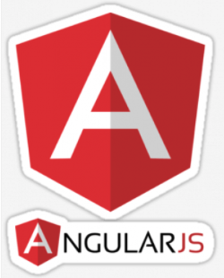

	

	
*see MP.ino for UF Stack implementation

	<h1>🌱Greenhouse MEAN Stack</h1>
	

		
		
		
		
		
		
		
	

	

	A Full Software Stack to gather, interact with, and record data from an environmental energy sensing, storing, and harvesting Hardware Stack.
	

	

		<h4>FrontEnd</h4>
		<h5>Client Side</h5>
		<ul>Uses AngularJs, CSS and/or animation styles to visually display vitals and sig events</ul>
		
<h5>SmartHome Dashboard:</h5>
			<ul>Displays all controllers with links to their homepages</ul>
			<ul>Displays Power data from MorningStar and keeps historical database</ul>
			<ul>Displays status of water lines from Arduino Yun garden program</ul>
			<ul>Allows for control of certain actuators via web UI</ul>
			<ul>Displays all useful incoming Bridge data points real-time</ul>
			<ul>Has navigation buttons to all live “rooms” under control 
				(i.e., Brewery, Shroomery, Greenhouse, ChickenCoop, Surveillance)</ul>
			<ul>Ledger – track income and expenses</ul>
			<ul>Inventory Database</ul>
			<ul>Displays historical charts</ul>
			<ul>Weather Station (compares forecast to actual experience)</ul>
			<ul>Links to Bankless Store Front with crowdfunding capability</ul>
		

		<h4>BackEnd</h4>
		
<h5>Java:</h5>
			<ul>Environment Sensing</ul>
			<ul>Power Management (uses incoming MorningStar data to run a power management program)</ul>
			<ul>GreenHouse/Garden Control (controls water, artificial light, airflow, humidty, etc.)</ul>
			<ul>Task Timing/Control (what happens when how often)</ul>
			<ul>Datalog</ul>
			<ul>Python Calls</ul>
			<ul>Low Voltage Actualization/Realization</ul>
		

		
<h5>Python:</h5>
			<ul>Link to MorningStar via Modbus</ul>
			<ul>Log data to file</ul>
			<ul>Get Weather</ul>
			<ul>Send Sig Event Emails</ul>
			<ul>Filesystem functions</ul>
		

		
<h4>The Hardware:</h4>
			<ul>Arduino micro controller coupled with a solar circuit using
				a Morningstar solar charge controller complete with panels
				and battery bank.
			</ul>
		

	

**Though the microcontrollers hold significant amounts of data and are stand alone units running SmartHome© and GreenHouse© , they are ultimately meant to connect to a localhost running on a more sophisticated processor where StoreFront©, BehindTheCounter©, and AngelTokens© can be implemented for Sales Inventory and Payflow as well as Crowdfunding.**

  
<a src="https://lucid.app/lucidchart/2583a382-273a-48f7-9c58-65a5fc4d5cf9/edit?view_items=qJbpXF30HLLe&invitationId=inv_0d67ca74-1058-44e4-b4be-61e5acd26da4#">Lucid Chart</a>

	
	
	
	
	
	
	
	
	
	

